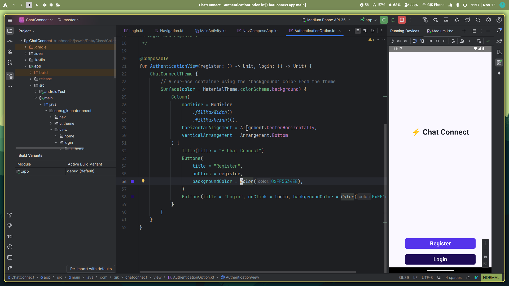
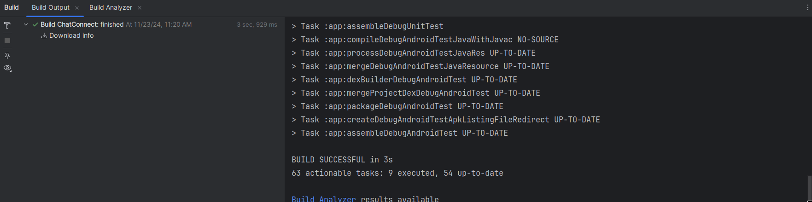
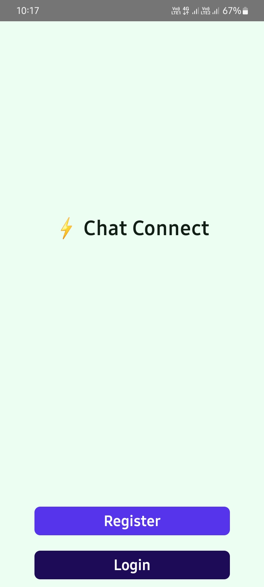
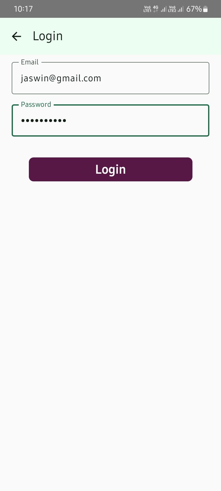
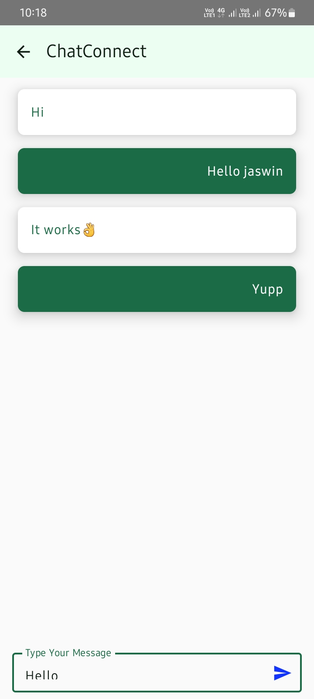
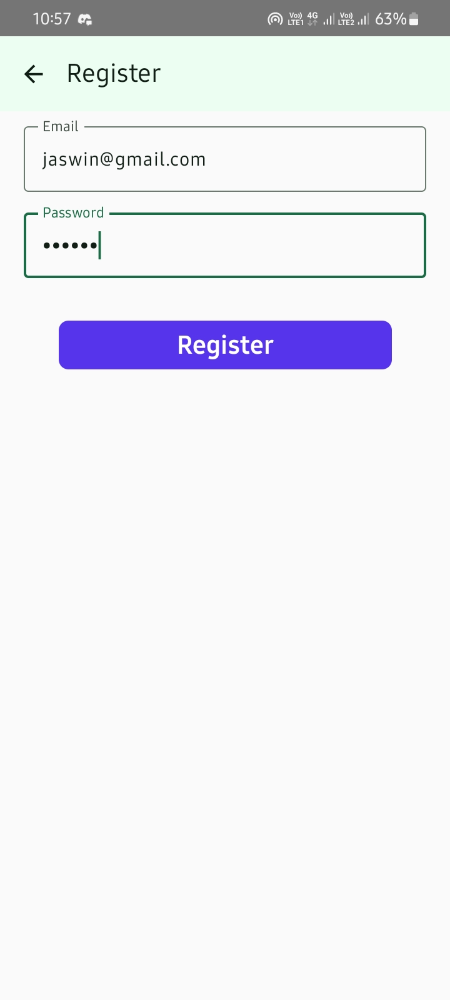

# Naan Mudhalvan Project - ChatConnect     

## Team Members
Jaswin Kumar N R  
Mohammed Thalha M  
Navamohan M  
Prince Kumar Mahto  
Esaky S  

## Get started

1. Clone the Repo
   ```bash
   git clone https://github.com/GJaswin/ChatConnect
   ```

2. Open the project in Android Studio

3. Configure Firebase in your project by going to Tools > Firebase and following the instructions.

4. To build the app, go to Build > Build App Bundle(s) / APK(s) > Build APK(s)

5. You can find the .apk in app/build/outputs/apk/debug/app-debug.apk

## Project Report

 ChatConnect is a chat application built for Android using Kotlin and Jetpack Compose, offering a seamless and intuitive user experience. Powered by Firebase Firestore for real-time database management and Firebase Authentication for secure user access, the app enables users to engage in fast, reliable, and secure communication. ChatConnect showcases the capabilities of Jetpack Compose in creating visually appealing and efficient layouts, while Firebase integration ensures scalability and real-time synchronization. 

### 1. Creating a Project in Android Studio
- Open Android Studio
- Go to File > New > New Project > Empty Activity to create a new project.
### 2. Building the project

The app was built by following the instructions from the SmartInternz Project Dashboard. 

### 3. Emulation
- First, create a virtual device in Android Studio by going to Device Manager > '+'.
- Choose a standard mobile device (Medium Phone API 35 was used here).
- Click on the Run button to run the app on the emulator in debug mode.

<div>
<center>
 <br>
<i>Emulation</i>
</center>
</div>

### 4. Building the APK
- To run the finished app on your own device, we need to build an APK file.
- Go to Build > Build App Bundle(s) / APK(s) > Build APK(s)
- This will build the app in debug mode. Wait for the app to finish building.
- To build the app in release mode, go to Build > Select Build Variant and select "Release"
- This will require you to sign the APK before running Build. Go to Build > Generate Signed APK / Bundle and follow the instructions to sign the APK.

<div>
<center>
 <br>
<i>Building the App</i>
</center>
</div>

### 5. Running the App on Local Hardware

Just install the .apk file and open it.
<div>
<center>
 
 <br>
 
 <br>
<h4>Recording</h4>


https://github.com/user-attachments/assets/5316f997-9769-4e2c-8749-6468e781b3ad  


</center>
</div>

